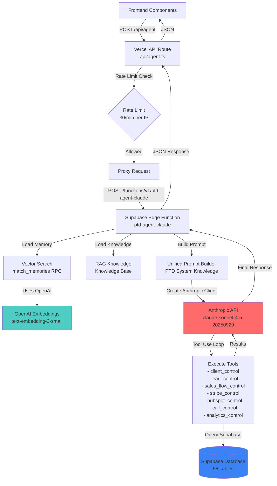

# AI Agent Architecture - Complete Flow & Proof

## 🎯 Executive Summary

**Your `/api/agent` endpoint uses:**
- ✅ **ANTHROPIC CLAUDE** (Claude Sonnet 4.5) - Primary AI model
- ✅ **OPENAI** (text-embedding-3-small) - For semantic search/embeddings
- ❌ **NOT OpenAI GPT** - No GPT models used
- ❌ **NOT Gemini** - Only used in other functions (ptd-agent-gemini)

---

## 📊 Complete Architecture Flow



---

## 🔍 PROOF: Code Evidence

### 1. Frontend → Vercel API Route

**File:** `api/agent.ts:114`
```typescript
// Proxy to Supabase Edge Function
const edgeFunctionUrl = `${SUPABASE_URL}/functions/v1/ptd-agent-claude`;
```

**Proof:** Vercel API proxies to `ptd-agent-claude` Supabase Edge Function.

---

### 2. Supabase Edge Function Uses ANTHROPIC

**File:** `supabase/functions/ptd-agent-claude/index.ts:2`
```typescript
import Anthropic from "https://esm.sh/@anthropic-ai/sdk@0.26.0";
```

**File:** `supabase/functions/ptd-agent-claude/index.ts:1054`
```typescript
const ANTHROPIC_API_KEY = Deno.env.get("ANTHROPIC_API_KEY");
```

**File:** `supabase/functions/ptd-agent-claude/index.ts:1072`
```typescript
const anthropic = new Anthropic({ apiKey: ANTHROPIC_API_KEY! });
```

**Proof:** Uses Anthropic SDK, requires `ANTHROPIC_API_KEY` environment variable.

---

### 3. Uses CLAUDE SONNET 4.5 Model

**File:** `supabase/functions/ptd-agent-claude/index.ts:968-969`
```typescript
const response = await anthropic.messages.create({
  model: "claude-sonnet-4-5-20250929",
  max_tokens: 4096,
  system: systemPrompt,
  tools,
  messages,
});
```

**Proof:** Explicitly uses `claude-sonnet-4-5-20250929` model.

---

### 4. Uses OPENAI for Embeddings (NOT GPT)

**File:** `supabase/functions/ptd-agent-claude/index.ts:93`
```typescript
const OPENAI_API_KEY = Deno.env.get('OPENAI_API_KEY');
```

**File:** `supabase/functions/ptd-agent-claude/index.ts:102`
```typescript
const response = await fetch('https://api.openai.com/v1/embeddings', {
  method: 'POST',
  headers: {
    'Authorization': `Bearer ${OPENAI_API_KEY}`,
    'Content-Type': 'application/json',
  },
  body: JSON.stringify({
    model: 'text-embedding-3-small',
    input: text.slice(0, 8000),
  }),
});
```

**Proof:** Uses OpenAI **ONLY** for embeddings (vector search), NOT for chat/completion.

---

### 5. Tool-Based Agent Architecture

**File:** `supabase/functions/ptd-agent-claude/index.ts:429-430`
```typescript
// Define tools for the agent (Anthropic format)
const tools: Anthropic.Tool[] = [
  {
    name: "client_control",
    description: "Get full client data - health scores, calls, deals, activities...",
    // ... more tools
  },
  {
    name: "lead_control",
    // ...
  },
  {
    name: "sales_flow_control",
    // ...
  },
  {
    name: "stripe_control",
    // ...
  },
  {
    name: "hubspot_control",
    // ...
  },
  {
    name: "call_control",
    // ...
  },
  {
    name: "analytics_control",
    // ...
  },
];
```

**Proof:** Agent uses **Anthropic Tool Use** pattern - Claude can call functions to query your database.

---

### 6. Tool Execution Loop

**File:** `supabase/functions/ptd-agent-claude/index.ts:964-1020`
```typescript
let iterations = 0;
const maxIterations = 8;

while (iterations < maxIterations) {
  iterations++;
  
  const response = await anthropic.messages.create({
    model: "claude-sonnet-4-5-20250929",
    // ...
  });
  
  // Check if done
  if (response.stop_reason === "end_turn") {
    finalResponse = response.content
      .filter((block): block is Anthropic.TextBlock => block.type === "text")
      .map((block) => block.text)
      .join("\n");
    break;
  }
  
  // Get tool use blocks
  const toolUseBlocks = response.content.filter(
    (block): block is Anthropic.ToolUseBlock => block.type === "tool_use"
  );
  
  // Execute tools in parallel
  const toolResults = await Promise.all(
    toolUseBlocks.map(async (toolUse) => {
      const result = await executeTool(supabase, toolUse.name, toolUse.input);
      return {
        type: "tool_result" as const,
        tool_use_id: toolUse.id,
        content: result,
      };
    })
  );
  
  // Add tool results to messages
  messages.push({ role: "user", content: toolResults });
}
```

**Proof:** Agent runs in a loop (max 8 iterations) where Claude can:
1. Decide to use tools
2. Execute tools (query database)
3. Get results
4. Generate final response

---

## 📋 Environment Variables Required

### Vercel (api/agent.ts)
- `SUPABASE_URL` ✅
- `SUPABASE_SERVICE_ROLE_KEY` ✅
- `AGENT_API_KEY` ⚠️ (optional)

### Supabase Edge Function (ptd-agent-claude)
- `ANTHROPIC_API_KEY` ✅ **REQUIRED**
- `OPENAI_API_KEY` ✅ **REQUIRED** (for embeddings)
- `SUPABASE_URL` ✅
- `SUPABASE_SERVICE_ROLE_KEY` ✅

---

## 🎯 Which Frontend Components Use This?

| Component | File | Purpose |
|-----------|------|---------|
| **FloatingChat** | `src/components/FloatingChat.tsx:256` | Main chat bubble |
| **VoiceChat** | `src/components/ai/VoiceChat.tsx:140` | Voice-to-text chat |
| **PTDUnlimitedChat** | `src/components/ai/PTDUnlimitedChat.tsx:315` | Unlimited chat panel |
| **PTDControlChat** | `src/components/ai/PTDControlChat.tsx:201` | Control panel chat |
| **AIAssistantPanel** | `src/components/ai/AIAssistantPanel.tsx:153` | AI assistant sidebar |

**All 5 components** → `POST /api/agent` → **Anthropic Claude**

---

## 🔄 Complete Request Flow

```
1. User types message in Frontend Component
   ↓
2. Frontend: POST /api/agent { message, thread_id }
   ↓
3. Vercel API Route (api/agent.ts):
   - Rate limit check (30/min per IP)
   - Validate env vars
   - Proxy to Supabase Edge Function
   ↓
4. Supabase Edge Function (ptd-agent-claude):
   - Load memory (vector search via OpenAI embeddings)
   - Load RAG knowledge
   - Build unified prompt
   - Create Anthropic client
   ↓
5. Anthropic Claude API:
   - Model: claude-sonnet-4-5-20250929
   - System prompt: PTD knowledge base (58 tables, 21 functions)
   - Tools: 7 tools (client_control, lead_control, etc.)
   - Tool execution loop (max 8 iterations)
   ↓
6. Tool Execution:
   - Claude decides which tool to use
   - Execute tool → Query Supabase database
   - Return results to Claude
   ↓
7. Claude generates final response
   ↓
8. Response flows back:
   Supabase Edge Function → Vercel API → Frontend Component
```

---

## ✅ Summary: What AI APIs Are Used?

| API | Purpose | Model | Required? |
|-----|---------|-------|-----------|
| **Anthropic Claude** | Main AI chat/completion | `claude-sonnet-4-5-20250929` | ✅ YES |
| **OpenAI** | Embeddings for vector search | `text-embedding-3-small` | ✅ YES |
| **OpenAI GPT** | ❌ NOT USED | - | ❌ NO |
| **Google Gemini** | ❌ NOT USED (only in ptd-agent-gemini) | - | ❌ NO |

---

## 🔐 Security & Rate Limiting

- **Rate Limit:** 30 requests/minute per IP (Vercel API)
- **API Key:** Optional (`AGENT_API_KEY`) - not currently enforced
- **Authentication:** Supabase service role key (server-side only)

---

## 📝 Notes

- **OpenAI is ONLY used for embeddings** - NOT for chat/completion
- **Anthropic Claude is the primary AI** - handles all conversation
- **Tool-based architecture** - Claude can query your database via tools
- **Memory system** - Uses vector search to remember past conversations
- **RAG knowledge** - Retrieves relevant knowledge from your database

---

**Last Updated:** 2025-12-20  
**Verified Against:** Codebase commit `25d6bac`


