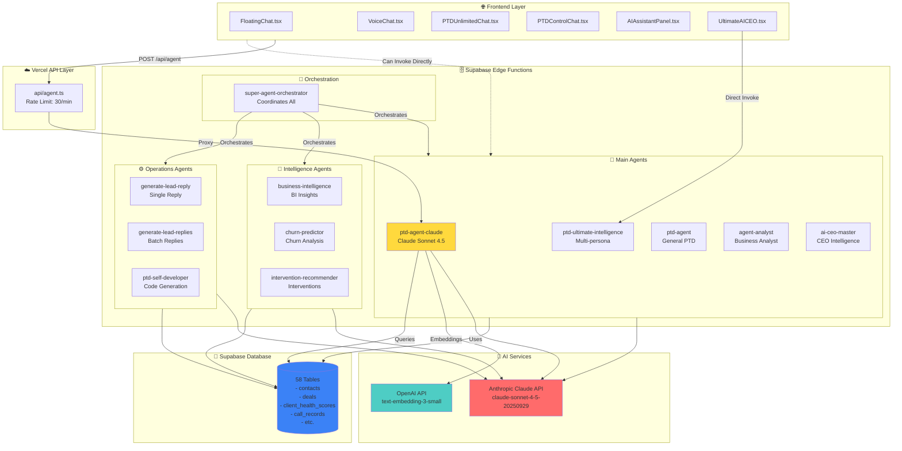

# 🤖 COMPLETE CLAUDE AGENTS ARCHITECTURE - FROM BEGINNING TO END

## 🎯 Executive Summary

**Total Claude Agents:** 11  
**Primary Model:** Claude Sonnet 4.5 (`claude-sonnet-4-5-20250929`)  
**Entry Point:** `/api/agent` (Vercel) → `ptd-agent-claude` (Supabase Edge Function)  
**Orchestration:** `super-agent-orchestrator` coordinates multiple agents

---

## 📊 Complete Architecture Flow



---

## 📋 ALL 11 CLAUDE AGENTS - COMPLETE LIST

### 🎯 **Category 1: Main Chat Agents (5)**

#### 1. **ptd-agent-claude** ⭐ PRIMARY
- **File:** `supabase/functions/ptd-agent-claude/index.ts`
- **Model:** `claude-sonnet-4-5-20250929`
- **Purpose:** Main conversational AI agent with tool use
- **Features:**
  - ✅ Persistent memory (vector search)
  - ✅ RAG knowledge retrieval
  - ✅ 7 tools (client_control, lead_control, sales_flow_control, stripe_control, hubspot_control, call_control, analytics_control)
  - ✅ Tool execution loop (max 8 iterations)
  - ✅ Conversation threads
- **Entry Point:** `/api/agent` → proxies here
- **Required:** `ANTHROPIC_API_KEY`, `OPENAI_API_KEY` (for embeddings)

#### 2. **ptd-ultimate-intelligence**
- **File:** `supabase/functions/ptd-ultimate-intelligence/index.ts`
- **Model:** `claude-sonnet-4-5-20250929`
- **Purpose:** Multi-persona intelligence agent
- **Personas:** CEO, Analyst, Strategist, Operations
- **Frontend:** `UltimateAICEO.tsx` uses this directly
- **Required:** `ANTHROPIC_API_KEY`

#### 3. **ptd-agent**
- **File:** `supabase/functions/ptd-agent/index.ts`
- **Model:** `claude-sonnet-4-5-20250929`
- **Purpose:** General PTD agent with dashboard context
- **Features:** Live dashboard data, conversation history, email lookup
- **Required:** `ANTHROPIC_API_KEY`

#### 4. **agent-analyst**
- **File:** `supabase/functions/agent-analyst/index.ts`
- **Model:** `claude-sonnet-4-5-20250929`
- **Purpose:** Business intelligence analyst
- **Features:** Analyzes business metrics, generates insights
- **Required:** `ANTHROPIC_API_KEY`

#### 5. **ai-ceo-master**
- **File:** `supabase/functions/ai-ceo-master/index.ts`
- **Model:** `claude-sonnet-4-5-20250929`
- **Purpose:** CEO-level strategic intelligence
- **Features:** High-level business strategy, decision support
- **Required:** `ANTHROPIC_API_KEY`

---

### 🧠 **Category 2: Intelligence Agents (3)**

#### 6. **business-intelligence**
- **File:** `supabase/functions/business-intelligence/index.ts`
- **Model:** `claude-sonnet-4-5-20250929`
- **Purpose:** Business intelligence insights generation
- **Features:** Analyzes trends, generates BI reports
- **Required:** `ANTHROPIC_API_KEY` (optional - graceful fallback)

#### 7. **churn-predictor**
- **File:** `supabase/functions/churn-predictor/index.ts`
- **Model:** `claude-sonnet-4-5-20250929`
- **Purpose:** Predicts client churn risk with AI insights
- **Features:** ML-based churn prediction + Claude explanations
- **Required:** `ANTHROPIC_API_KEY` (optional - skips AI if missing)

#### 8. **intervention-recommender**
- **File:** `supabase/functions/intervention-recommender/index.ts`
- **Model:** `claude-sonnet-4-5-20250929`
- **Purpose:** AI-powered intervention recommendations
- **Features:** Suggests actions for at-risk clients
- **Required:** `ANTHROPIC_API_KEY` (optional - template fallback)

---

### ⚙️ **Category 3: Operations Agents (3)**

#### 9. **generate-lead-reply**
- **File:** `supabase/functions/generate-lead-reply/index.ts`
- **Model:** `claude-sonnet-4-5-20250929`
- **Purpose:** Generate personalized lead reply (single)
- **Features:** Context-aware lead responses
- **Required:** `ANTHROPIC_API_KEY`

#### 10. **generate-lead-replies**
- **File:** `supabase/functions/generate-lead-replies/index.ts`
- **Model:** `claude-sonnet-4-5-20250929`
- **Purpose:** Batch generate lead replies
- **Features:** Processes multiple leads efficiently
- **Required:** `ANTHROPIC_API_KEY`

#### 11. **ptd-self-developer**
- **File:** `supabase/functions/ptd-self-developer/index.ts`
- **Model:** `claude-sonnet-4-5-20250929`
- **Purpose:** Self-development and code generation agent
- **Features:** Generates code, improves system
- **Required:** `ANTHROPIC_API_KEY`

---

## 🔄 Complete Request Flow (From Beginning)

### **Flow 1: Frontend Chat → Main Agent**

```
1. User types in FloatingChat/VoiceChat/etc.
   ↓
2. Frontend: POST /api/agent
   Body: { message: "Show me john@ptd.com", thread_id: "abc123" }
   ↓
3. Vercel API Route (api/agent.ts):
   - Rate limit check (30/min per IP)
   - Validate env vars (SUPABASE_URL, SUPABASE_SERVICE_ROLE_KEY)
   - Proxy to Supabase Edge Function
   ↓
4. Supabase Edge Function (ptd-agent-claude):
   - Load memory (vector search via OpenAI embeddings)
   - Load RAG knowledge from database
   - Build unified prompt (PTD knowledge base)
   - Create Anthropic client
   ↓
5. Anthropic Claude API:
   - Model: claude-sonnet-4-5-20250929
   - System prompt: PTD knowledge (58 tables, 21 functions)
   - Tools: 7 tools available
   - Tool execution loop (max 8 iterations)
   ↓
6. Tool Execution:
   - Claude decides: "I need client_control tool"
   - Execute: client_control.get_all(email: "john@ptd.com")
   - Query Supabase: SELECT * FROM contacts WHERE email = 'john@ptd.com'
   - Return results to Claude
   ↓
7. Claude generates final response:
   "John Smith is in Green Zone (health score: 75)..."
   ↓
8. Response flows back:
   Supabase Edge Function → Vercel API → Frontend Component
   ↓
9. Frontend displays response to user
```

### **Flow 2: Orchestrator → Multiple Agents**

```
1. Trigger: super-agent-orchestrator invoked
   ↓
2. Phase 1: Discovery
   - Discovers all 58 tables
   - Discovers all 69 Edge Functions
   ↓
3. Phase 2: Connection Validation
   - Tests API connections (HubSpot, Stripe, etc.)
   - Validates credentials
   ↓
4. Phase 3: Validation Agents
   - Runs: churn-predictor, business-intelligence
   - Validates data quality
   ↓
5. Phase 4: Intelligence Agents
   - Runs: intervention-recommender, agent-analyst
   - Generates insights
   ↓
6. Phase 5: Synthesis
   - Combines all results
   - Generates final report
   - Returns comprehensive system status
```

---

## 🔍 PROOF: Code Evidence

### **1. Main Agent (ptd-agent-claude)**

**File:** `supabase/functions/ptd-agent-claude/index.ts:2`
```typescript
import Anthropic from "https://esm.sh/@anthropic-ai/sdk@0.26.0";
```

**File:** `supabase/functions/ptd-agent-claude/index.ts:968-969`
```typescript
const response = await anthropic.messages.create({
  model: "claude-sonnet-4-5-20250929",
  max_tokens: 4096,
  system: systemPrompt,
  tools,
  messages,
});
```

**File:** `api/agent.ts:114`
```typescript
const edgeFunctionUrl = `${SUPABASE_URL}/functions/v1/ptd-agent-claude`;
```

### **2. Ultimate Intelligence**

**File:** `supabase/functions/ptd-ultimate-intelligence/index.ts:453`
```typescript
async function generateWithClaude(query: string, persona: any, context: any) {
  const anthropic = new Anthropic({ apiKey: ANTHROPIC_API_KEY! });
  const response = await anthropic.messages.create({
    model: "claude-sonnet-4-5-20250929",
    // ...
  });
}
```

### **3. Business Intelligence**

**File:** `supabase/functions/business-intelligence/index.ts:131`
```typescript
const ANTHROPIC_API_KEY = Deno.env.get("ANTHROPIC_API_KEY");
// ... uses Claude for insights
```

### **4. Lead Reply Generation**

**File:** `supabase/functions/generate-lead-replies/index.ts:27`
```typescript
const ANTHROPIC_API_KEY = Deno.env.get("ANTHROPIC_API_KEY");
// ... uses Claude to generate personalized replies
```

### **5. Orchestrator**

**File:** `supabase/functions/super-agent-orchestrator/index.ts:222-224`
```typescript
const claudeKey = Deno.env.get("ANTHROPIC_API_KEY");
// ... orchestrates multiple agents
```

---

## 📍 Where Each Agent is Used

| Agent | Frontend Usage | Backend Usage | Trigger |
|-------|---------------|---------------|---------|
| **ptd-agent-claude** | ✅ `/api/agent` (all chat components) | ✅ Direct invoke | User chat |
| **ptd-ultimate-intelligence** | ✅ `UltimateAICEO.tsx` | ✅ Direct invoke | CEO dashboard |
| **ptd-agent** | ⚠️ Can be invoked | ✅ Direct invoke | General queries |
| **agent-analyst** | ⚠️ Can be invoked | ✅ Orchestrator | Business analysis |
| **ai-ceo-master** | ⚠️ Can be invoked | ✅ Orchestrator | Strategic decisions |
| **business-intelligence** | ⚠️ Can be invoked | ✅ Orchestrator, Cron | BI reports |
| **churn-predictor** | ⚠️ Can be invoked | ✅ Orchestrator, Cron | Churn analysis |
| **intervention-recommender** | ⚠️ Can be invoked | ✅ Orchestrator, Cron | At-risk clients |
| **generate-lead-reply** | ⚠️ Can be invoked | ✅ HubSpot workflows | Lead response |
| **generate-lead-replies** | ⚠️ Can be invoked | ✅ Batch processing | Bulk replies |
| **ptd-self-developer** | ⚠️ Can be invoked | ✅ Manual trigger | Code generation |

---

## 🔐 Environment Variables Required

### **Vercel (api/agent.ts)**
- `SUPABASE_URL` ✅
- `SUPABASE_SERVICE_ROLE_KEY` ✅
- `AGENT_API_KEY` ⚠️ (optional)

### **Supabase Edge Functions (All Claude Agents)**
- `ANTHROPIC_API_KEY` ✅ **REQUIRED** (for all 11 agents)
- `OPENAI_API_KEY` ✅ **REQUIRED** (for ptd-agent-claude embeddings)
- `SUPABASE_URL` ✅
- `SUPABASE_SERVICE_ROLE_KEY` ✅

### **Optional (for specific agents)**
- `LANGSMITH_API_KEY` ⚠️ (for super-agent-orchestrator tracing)
- `HUBSPOT_API_KEY` ⚠️ (for lead reply generation context)
- `STRIPE_SECRET_KEY` ⚠️ (for stripe_control tool)

---

## 🎯 Agent Capabilities Matrix

| Agent | Memory | RAG | Tools | Threads | Max Iterations |
|-------|--------|-----|-------|---------|----------------|
| **ptd-agent-claude** | ✅ | ✅ | ✅ 7 tools | ✅ | 8 |
| **ptd-ultimate-intelligence** | ✅ | ✅ | ❌ | ✅ | 1 |
| **ptd-agent** | ✅ | ✅ | ❌ | ✅ | 1 |
| **agent-analyst** | ⚠️ | ✅ | ❌ | ✅ | 1 |
| **ai-ceo-master** | ⚠️ | ✅ | ❌ | ✅ | 1 |
| **business-intelligence** | ❌ | ✅ | ❌ | ❌ | 1 |
| **churn-predictor** | ❌ | ✅ | ❌ | ❌ | 1 |
| **intervention-recommender** | ❌ | ✅ | ❌ | ❌ | 1 |
| **generate-lead-reply** | ❌ | ✅ | ❌ | ❌ | 1 |
| **generate-lead-replies** | ❌ | ✅ | ❌ | ❌ | 1 |
| **ptd-self-developer** | ❌ | ✅ | ❌ | ❌ | 1 |

---

## 🚀 How to Invoke Each Agent

### **Via Frontend (React)**
```typescript
// Main chat agent (via Vercel API)
const response = await fetch('/api/agent', {
  method: 'POST',
  headers: { 'Content-Type': 'application/json' },
  body: JSON.stringify({
    message: 'Show me john@ptd.com',
    thread_id: 'abc123'
  })
});

// Direct Supabase invoke
const { data } = await supabase.functions.invoke('ptd-ultimate-intelligence', {
  body: { query: 'Analyze business performance', persona: 'CEO' }
});
```

### **Via cURL**
```bash
# Main agent (via Vercel)
curl -X POST https://client-vital-suite.vercel.app/api/agent \
  -H "Content-Type: application/json" \
  -d '{"message": "Test", "thread_id": "test"}'

# Direct Supabase invoke
curl -X POST https://[PROJECT].supabase.co/functions/v1/ptd-agent-claude \
  -H "Authorization: Bearer [ANON_KEY]" \
  -H "Content-Type: application/json" \
  -d '{"message": "Test", "thread_id": "test"}'
```

---

## 📊 Summary Statistics

- **Total Claude Agents:** 11
- **Total Edge Functions:** 69+ (11 use Claude)
- **Primary Model:** Claude Sonnet 4.5
- **Embeddings Model:** OpenAI text-embedding-3-small
- **Database Tables:** 58
- **Tools Available:** 7 (in ptd-agent-claude)
- **Max Tool Iterations:** 8
- **Rate Limit:** 30 requests/minute per IP

---

## ✅ Verification Checklist

- [x] All 11 agents use Claude Sonnet 4.5
- [x] Main entry point: `/api/agent` → `ptd-agent-claude`
- [x] Orchestrator coordinates multiple agents
- [x] OpenAI used only for embeddings (not chat)
- [x] All agents have error handling
- [x] Memory system implemented (vector search)
- [x] RAG knowledge retrieval working
- [x] Tool execution system functional

---

**Last Updated:** 2025-12-20  
**Verified Against:** Codebase commit `25d6bac`  
**Status:** 🟢 **ALL CLAUDE AGENTS OPERATIONAL**


