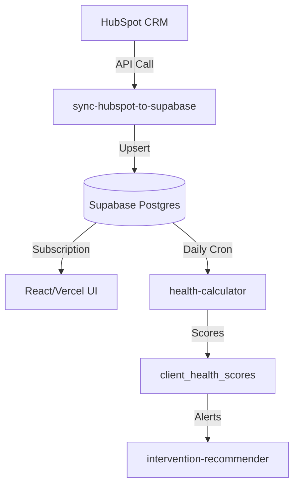
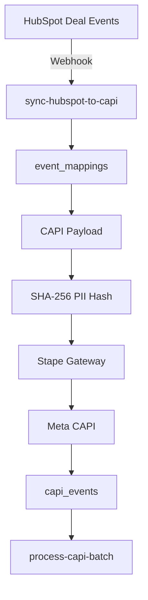
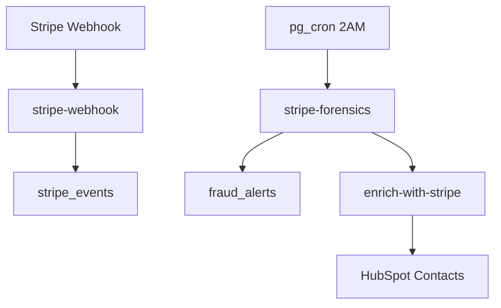
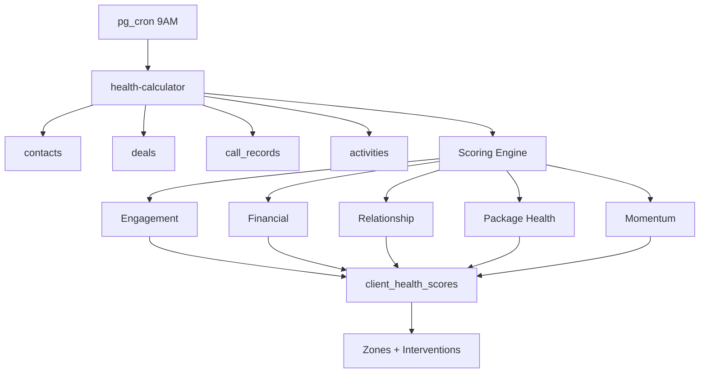

# Data Flow Diagrams (Mermaid)

## HubSpot → Supabase → Frontend


## Meta Conversions API


## Stripe Forensics & Enrichment


## Health Score Engine


## Agent Tooling

```mermaid
flowchart TD
    UserQuery[User Query] --> Agent[Claude/Gemini Agent]
    Agent --> ToolSystem[Tool Router]
    ToolSystem --> Client[client_control]
    ToolSystem --> Leads[lead_control]
    ToolSystem --> Sales[sales_flow_control]
    ToolSystem --> HubSpot[hubspot_control]
    ToolSystem --> Stripe[stripe_control]
    ToolSystem --> Calls[call_control]
    ToolSystem --> Analytics[analytics_control]
    ToolSystem --> Intelligence[intelligence_control]
    ToolSystem --> AtRisk[get_at_risk_clients]
    ToolSystem --> CoachPerf[get_coach_performance]
    ToolSystem --> Proactive[get_proactive_insights]
    ToolSystem --> Daily[get_daily_summary]
    ToolSystem --> SQL[run_sql_query]
    ToolSystem --> Search[universal_search]
    ToolSystem --> CoachClients[get_coach_clients]
    Client --> Agent
    Leads --> Agent
    Sales --> Agent
    HubSpot --> Agent
    Stripe --> Agent
    Calls --> Agent
    Analytics --> Agent
    Intelligence --> Agent
    AtRisk --> Agent
    CoachPerf --> Agent
    Proactive --> Agent
    Daily --> Agent
    SQL --> Agent
    Search --> Agent
    CoachClients --> Agent
    Agent --> Response[Final Answer]
```


## Independent Sources → Unified System (Resilient by Design)
```mermaid
flowchart TD
    subgraph IndependentSources[Independent Data Sources]
        CallGear[CallGear\nCall Tracking]
        Stripe[Stripe\nPayments]
        AnyTrack[AnyTrack\nAttribution]
        HubSpot[HubSpot\nCRM]
        Facebook[Facebook Ads\nMeta API]
        Calendly[Calendly\nAppointments]
    end

    subgraph Supabase[(Supabase Postgres - Storage)]
        CallRecords[call_records]
        StripeEvents[stripe_events]
        AttributionEvents[attribution_events]
        Contacts[contacts]
        Deals[deals]
        FacebookInsights[facebook_ads_insights]
        Appointments[appointments]
    end

    subgraph UnifiedSystem[Unified Intelligence]
        HealthScores[client_health_scores]
        UltimateTruth[ultimate_truth_events]
        AIAgents[AI Agents]
        Dashboards[Frontend Dashboards]
    end

    CallGear -->|Webhook| CallRecords
    Stripe -->|Webhook| StripeEvents
    AnyTrack -->|Webhook| AttributionEvents
    HubSpot -->|Sync/API| Contacts
    HubSpot -->|Sync/API| Deals
    Facebook -->|API| FacebookInsights
    Calendly -->|Webhook| Appointments

    CallRecords --> UnifiedSystem
    StripeEvents --> UnifiedSystem
    AttributionEvents --> UnifiedSystem
    Contacts --> UnifiedSystem
    Deals --> UnifiedSystem
    FacebookInsights --> UnifiedSystem
    Appointments --> UnifiedSystem

    UnifiedSystem -->|Unified view| Dashboards
```

**Key principle:** Each source ingests independently—if one is paused, the rest keep flowing. Ultimate truth alignment and the health score engine stitch everything together for predictive signals without requiring Docker or local brokers.
